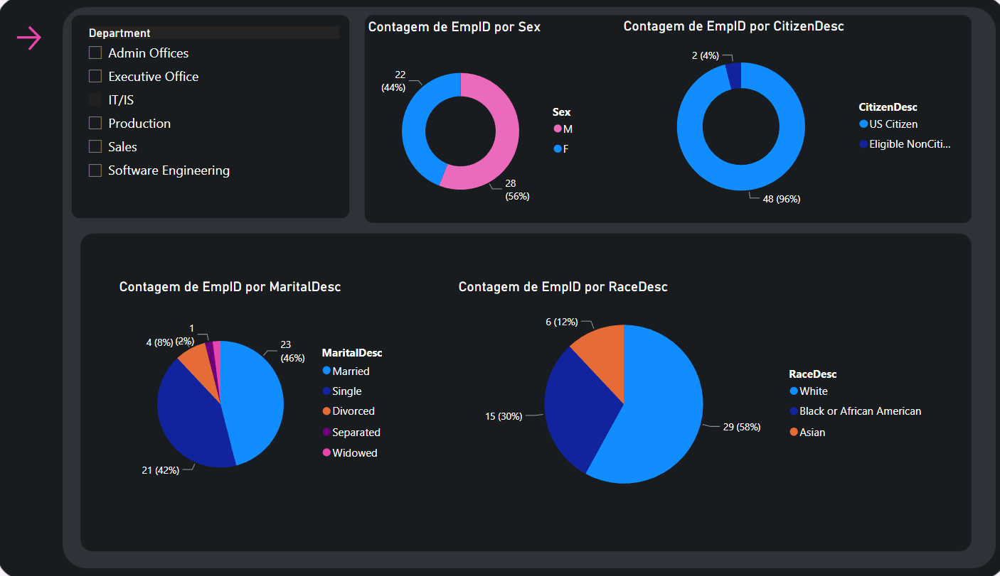
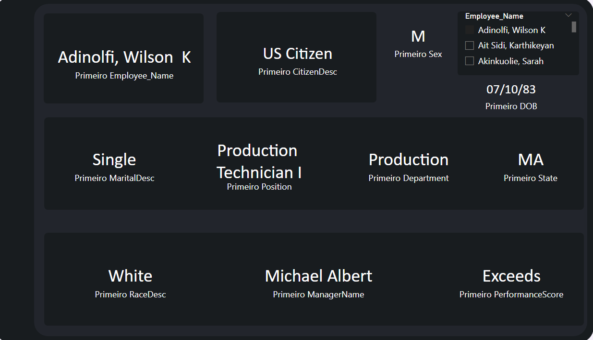

# Análise do painel de RH de uma corporação dos Estados Unidos

### Pontos estudados:

* Construindo um painel de RH atraente e atraente
* Visualizando a diversidade racial e de gênero usando gráficos e gráficos no Power BI
* Adicionando botões, temas e filtros para tornar o painel interativo e inteligente

### Tela 1:

### Tela 2:

### Certificação

